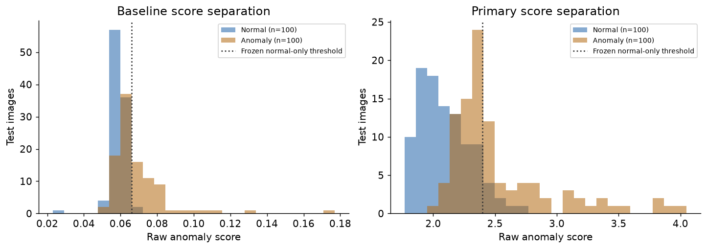
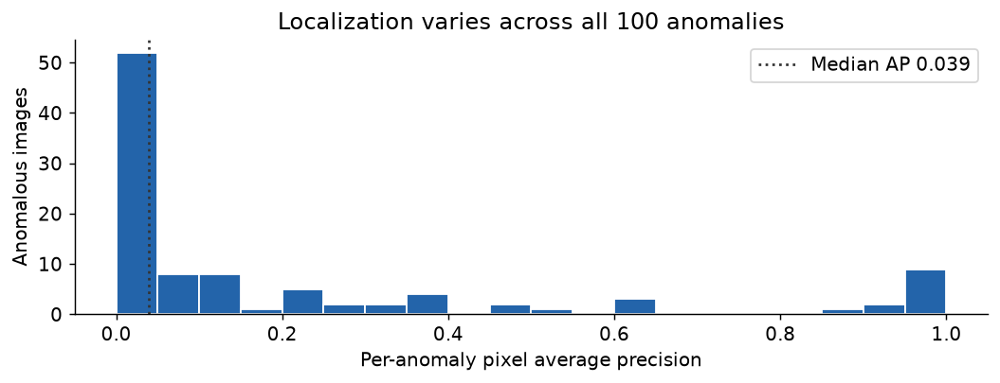

# PCB visual inspection feasibility pilot

A local educational project using public **VisA PCB1**, exploring whether visible
anomaly scores and suspicious-region maps can support a human inspection workflow.
It uses no Seagate data and establishes no factory performance or root causes.

The initial scope is **Phase A**: a frozen global-embedding nearest-normal baseline
versus a clearly labeled **PatchCore-inspired** normal patch-memory detector.
Both use frozen ResNet18 features. Normal-only calibration and an exclusive guarded
final evaluation preserve the official benchmark and prohibit test-driven tuning.
The review application and Ollama integration follow a separate decision.

## Measured Phase A outcome

**Recommendation: stop/revise methodology.** All 30 tests pass, and the final
metrics/reference traces were independently checked. The executed pilot is complete.

| Method | Image AP | AUROC | Recall | Normal false alarms |
| --- | ---: | ---: | ---: | ---: |
| Global embedding baseline |0.8276|0.7872|43/100|2/100|
| PatchCore-inspired |0.8516|0.8654|43/100|9/100|

Pooled pixel AP is 0.7920, but median per-anomaly AP is only 0.0393; heatmap peaks
fall inside annotations for 26/100 anomalies. CPU inference takes 0.307 s median
(0.335 s p95). This is useful experimental evidence, but insufficient to support a
reliable small-region inspection workflow. [Full findings](docs/pilot_findings.md)
include failures, protocol, runtime, provenance and proposed next study.

## Inspect the first findings





The [localization examples](artifacts/runs/31e0704ff1da6906/localization_examples.png)
include a missed anomaly and a false alarm alongside stronger examples. Source masks
are shown only as retrospective benchmark annotations. Predictions, thresholds,
metrics, runtime and verification receipts are saved under
[`artifacts/runs/31e0704ff1da6906`](artifacts/runs/31e0704ff1da6906).

## Setup

Python 3.11 on macOS ARM64 was used. Create an isolated environment, then install
exact successful dependency versions:

```bash
python3.11 -m venv .venv
.venv/bin/python -m pip install -r requirements.lock
.venv/bin/python -m pip install --no-build-isolation -e .
source .venv/bin/activate
```

Raw data, feature arrays and checkpoints are Git-ignored. Owner-hosted VisA is
CC BY 4.0; attribution and weight-use limitations are in
[the source record](docs/source_research.md) and [data card](docs/data_card.md).
The acquisition command selectively retrieves PCB1 via validated byte ranges;
it never silently downloads the full 1.80 GiB archive:

```bash
python -m pcb_inspection.acquisition --destination data/raw
python -c "from pcb_inspection.data import build_manifest; print(build_manifest('data/raw','data/raw/1cls.csv','data/manifests'))"
```

## Reproduce the saved pilot

Start with [the executed notebook](notebooks/pcb1_pilot.ipynb),
[measured findings](docs/pilot_findings.md), [protocol](docs/protocol.md),
and [exposure ledger](docs/exposure_ledger.md). The notebook reads saved evidence;
rerunning it does not fit or unseal the benchmark again.

This GitHub snapshot includes the notebook's executed outputs, predictions, manifests,
metrics, provenance and rendered figures. Raw images, pretrained weights, fitted
reference models, feature arrays and full anomaly-map arrays are excluded. You can
inspect the published evidence directly on GitHub. Executing the artifact-reading
notebook requires the corresponding local data/cache and anomaly maps; a fresh clone
alone does not contain those large local artifacts.

For a **separate reproduction workspace without the saved final run or access receipts**,
after acquiring/auditing
raw data and caching the exact official checkpoint under
`data/cache/hub/checkpoints/resnet18-f37072fd.pth`, run the normal preparation and
then the guarded final command:

```bash
python -m pcb_inspection.checks
python -m pcb_inspection.pilot prepare
python -m pcb_inspection.evaluate_test --config configs/pilot.yaml --protocol docs/protocol.json --confirm-frozen-protocol
python -m pcb_inspection.verify_results --run artifacts/runs/RUN_ID --raw-root data/raw
```

These commands document the original execution sequence. Preserve the published run
and receipts as historical evidence; a new experiment needs a separate workspace and
its own frozen protocol. The original final test has already been viewed, so rerunning
it is replication rather than fresh validation.

The exact frozen protocol expects the recorded source/config/code/manifest/weight
identities, successful tests, calibration and leakage/resource gates. It refuses
changed content or an existing final-access receipt. A new machine or changed recipe
requires its own explicitly documented protocol, rather than quietly modifying this
run. See `artifacts/tests_passed.json` for the measured verification receipt.

No anomaly model was fine-tuned; uniform memory sampling is a departure from the
PatchCore coreset method. Direct 256-square resizing can discard small defects;
benchmark prevalence and acquisition conditions cannot establish factory precision.
Local pretrained-weight use is educational; commercial rights remain unverified.
