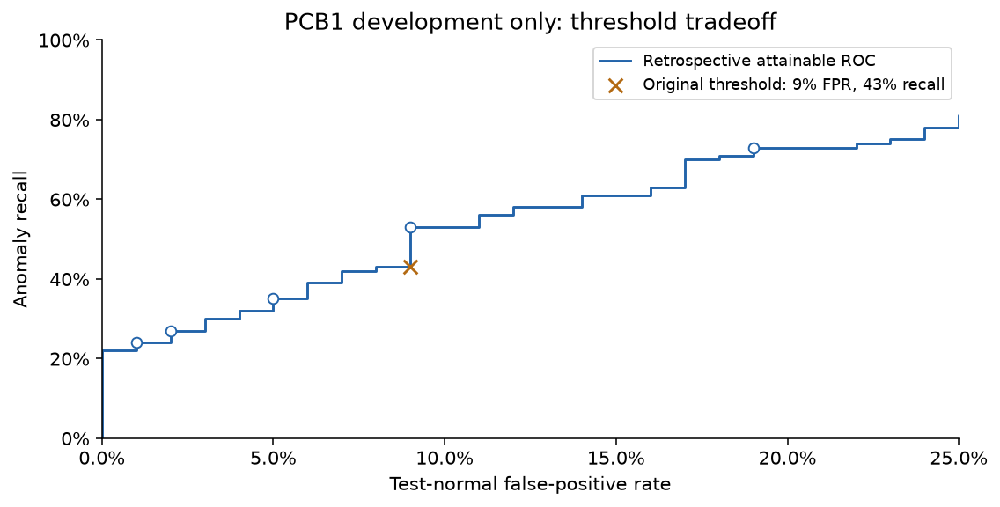
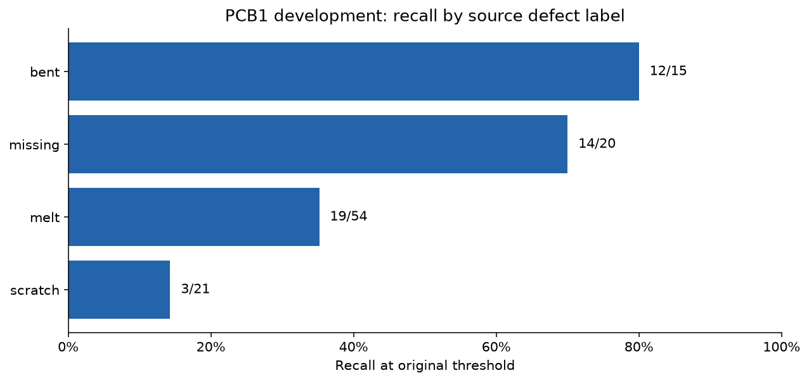
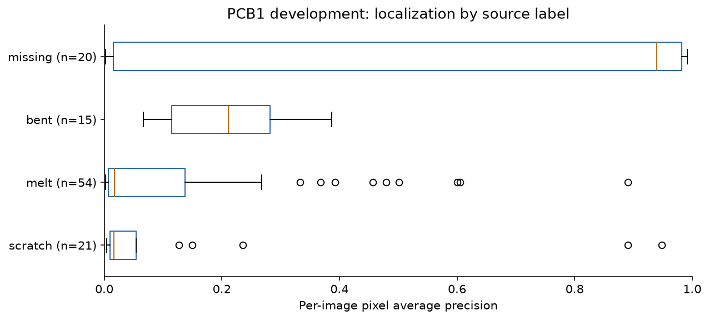
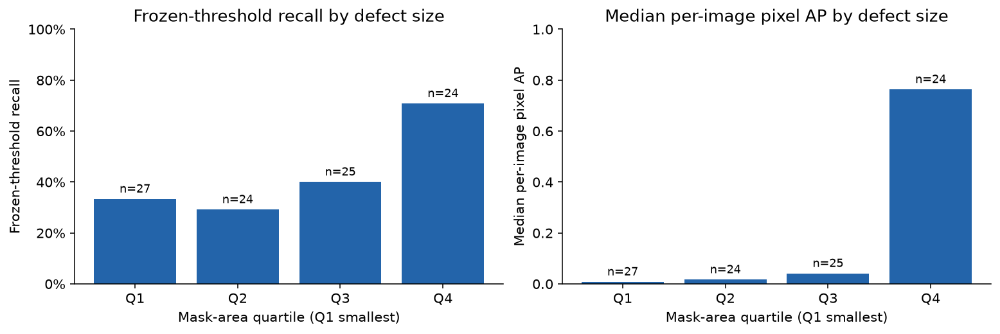
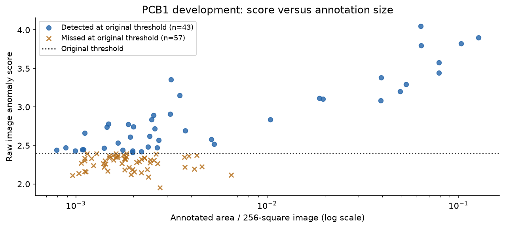
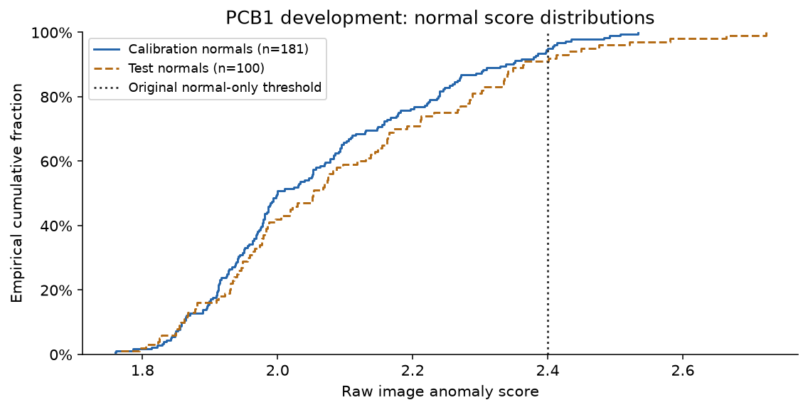

# PCB1 A2: what the first pilot missed, and what to test next

Executed 2026-10-02 America/Vancouver. **Development diagnostics only.** All results
reuse frozen Run 1 scores/maps; the detector, memories and original thresholds remain
unchanged. PCB1 has been unsealed and is not fresh validation. PCB2 is still sealed.

The strongest next hypothesis is **effective image detail and board geometry**,
particularly for source-labeled scratch and melt examples. Threshold placement also
matters, but threshold adjustment alone cannot repair weak localization. These are
priorities for controlled tests, not demonstrated model improvements.

## 1. How many misses can threshold changes recover?

The original normal-only threshold 2.4000701904 detects 43/100 anomalies with 9/100
normal false alarms. Retrospective ROC operating points are:

| Maximum allowed FPR | Realized FPR | Recall | TP | FN | FP | TN |
| --- | ---: | ---: | ---: | ---: | ---: | ---: |
| 1% | 1% | 24% | 24 | 76 | 1 | 99 |
| 2% | 2% | 27% | 27 | 73 | 2 | 98 |
| 5% | 5% | 35% | 35 | 65 | 5 | 95 |
| 10% | 9% | 53% | 53 | 47 | 9 | 91 |
| 20% | 19% | 73% | 73 | 27 | 19 | 81 |

At a retrospective threshold of 2.3642535210, 10 additional anomalies are detected
with the same nine observed false alarms. At the 20% budget, 30 additional anomalies
are detected while adding ten false alarms. Conversely, a 5% retrospective FPR
constraint allows only 35% recall: poor separation remains at a stricter review budget.

These thresholds maximize observed recall within an FPR budget using the already
viewed PCB1 labels. They are **diagnostic oracle points**, not independently selected
operating settings or a promise of future recall/FPR. The original threshold remains
in force for all defect-type, size and qualitative analyses below.



## 2. Which source-labeled defects are weakest?

| Source defect label | Images carrying label | Detected / missed | Recall | Median per-image pixel AP | Peak inside union mask |
| --- | ---: | ---: | ---: | ---: | ---: |
| scratch | 21 | 3 / 18 | 14.3% | 0.0160 | 4/21 |
| melt | 54 | 19 / 35 | 35.2% | 0.0174 | 6/54 |
| missing | 20 | 14 / 6 | 70.0% | 0.9393 | 13/20 |
| bent | 15 | 12 / 3 | 80.0% | 0.2108 | 7/15 |

Nine images have multiple source labels, including one with three. Each contributes
once per listed type, giving 110 memberships across 100 distinct images. Localization
uses each image's union anomaly mask, not a separately isolated mask for each type.
Groups are overlapping and cannot be summed as independent defects or outcomes.
Named types come from owner annotations; they are not model-generated diagnoses.

The plan's concern about missing/bent components is worth testing, but these are not
the weakest observed categories. Current evidence prioritizes scratch and melt.




## 3. Are small defects disproportionately difficult?

| Mask-area group | Images | Recall | Median per-image pixel AP | Peak inside mask |
| --- | ---: | ---: | ---: | ---: |
| Q1, smallest | 27 | 33.3% | 0.0079 | 1/27 |
| Q2 | 24 | 29.2% | 0.0165 | 3/24 |
| Q3 | 25 | 40.0% | 0.0410 | 6/25 |
| Q4, largest | 24 | 70.8% | 0.7635 | 16/24 |

Quartiles use higher empirical boundaries and retain equal-area ties in the same
lower group; they therefore do not all contain 25 images. Areas and centroids refer
to the original 256-square evaluation geometry. Q1 positive masks cover roughly
0.079–0.150% of the image; Q4 covers roughly 0.349–12.723%.

Scores and annotation area are positively associated (Spearman rho 0.411). This is
not a monotonic guarantee: Q2 recall is lower than Q1. Defect size and defect type
are confounded, so the difference is not a causal estimate of resizing loss.




## 4. Do detection and localization fail on the same images?

Mostly, under the original threshold. The 57 misses have median per-image pixel AP
0.0099, with map peaks inside the annotation for 3/57 (5.3%). The 43 detected anomalies
have median AP 0.3509 and peak-inside-mask count 23/43 (53.5%). All detected anomalies
have some thresholded overlap; 36/57 misses do too. Any overlap is a weak success
criterion because broad maps can touch a tiny defect while mostly highlighting other
pixels. The retained per-image IoU and binary-map views make this visible.

The distinction remains important: a true-positive image flag can have poor
localization. The qualitative sheet deliberately includes that case, close and
low-score misses, the smallest quartile, each source type and two normal false alarms.
Selections are deterministic and recorded in `qualitative/selection.csv`; no handpicked
success-only gallery is used.

## 5. Is the normal-score distribution shifted?

Calibration normals (181): mean 2.0618, median 1.9997, 95th percentile 2.4001;
9/181 (4.97%) exceed the frozen threshold. Test normals (100): mean 2.0964, median
2.0528, 95th percentile 2.4509; 9/100 (9%) exceed it. The test distribution has somewhat
higher observed scores/tails, but these samples do not establish a real shift.

An exploratory two-sample KS distance is 0.1019 (p=0.4766 under independent-image
assumptions). A 95% Wilson interval for 9/100 is approximately 4.8–16.2%, which includes
5%. Neither calculation proves absence of shift. Physical-board independence is
unverified, and the threshold itself was estimated from a finite normal calibration
sample. Therefore neither “calibration is broken” nor “there is definitely no shift”
is justified. The exact descriptive tables and empirical CDF are retained.

[Wilson interval implementation and assumptions](https://docs.scipy.org/doc/scipy/reference/generated/scipy.stats._result_classes.BinomTestResult.proportion_ci.html).



## 6. Does this prove that 256 resizing causes the misses?

No. Poor localization for small annotations, score/size association, broad maps and
stronger large-region cases support the hypothesis. They do not isolate the effect
of resolution from feature sensitivity, aggregation, memory coverage, board pose,
annotation geometry or defect type. A matched preprocessing/resolution comparison is
needed. The original mask audit found no completely vanished annotation, but surviving
mask pixels do not prove that visible defect detail survived RGB resizing.

The next useful test should increase pixels devoted to the board while keeping the
backbone, memory budget, scoring and normal-only threshold policy controlled. Crops
must be computed from image content or fitting-normal templates, never per-image
anomaly masks. Preserve edges/connectors, source-coordinate transforms and failures.

## 7. Does cross-location matching explain the misses?

The saved maximum-score traces do not support that conclusion. Offsets outside a
radius of two unregistered feature cells occur in 15/57 misses (26.3%) and 19/43
true positives (44.2%). Missing-labeled images have 9/20 such traces, but these are
not isolated defect patches and multi-label groups overlap.

The maximum-score patch can be elsewhere on the image. Source pose/translation and
180-degree orientation differences also make coordinates incomparable without
registration. These traces cannot establish which normal features matched a missed
defect itself. Defer a spatial-radius sweep until geometry is reliable; if needed,
predeclare a small retrospective defect-region trace sample with matched controls.
See `trace_summary.md` for the evidence and limits.

## Decision and next sequence

1. **Geometry feasibility first:** deterministic fitting-normal-derived board crop,
   aspect preservation and pose checks; record transforms/failures and visualize
   representative normals. Registration is a candidate with a measurable error/failure
   criterion, not an assumed universal improvement.
2. **Matched geometry/resolution comparison:** retain ResNet18, the existing score
   rule and a fixed memory budget. Compare verified board geometry at 256 and 512;
   save recalibrated normal-only thresholds and full development metrics for each.
   Report that fixed patch count gives a smaller memory fraction at higher resolution.
3. **Coreset next:** compare uniform and approximate greedy selection at matched bank
   counts, and separately assess a larger bank only if resource measurements permit.
4. **Backbone last:** choose an explicitly pinned author-code or paper recipe and
   smoke-test a WideResNet candidate before full fitting. A naive 512 raw feature bank
   is approximately 16.95 GiB before intermediates; a 5–10% bank also makes exact CPU
   search much larger. These analytical costs are not measured latency or model gains.
5. Keep PCB2 sealed until a complete resource-feasible recipe, split/calibration
   procedure and metrics are frozen. Its own normal memory/calibration make this a
   fresh-category recipe confirmation, not zero-shot PCB1-to-PCB2 transfer.

These are bounded hypotheses. No replacement detector, new performance claim,
registration implementation, PCB2 evaluation, UI or Ollama integration was executed
as part of A2. `docs/improvement_plan_review.md` and `docs/improvement_feasibility.md`
provide primary-source method corrections and engineering costs.

## Validation and reproduction

All A2 numerical outputs have input/output hashes. Independent checks reconciled all
100 anomaly IDs/scores/flags and per-image localization against the independently
computed Run 1 review; all 281 normal IDs/scores; the full ROC against a separate
implementation; every operating-point confusion count; and all 110 label memberships.
Original frozen source/config/manifest and Run 1 output identities remain unchanged.

All 43 tests pass. The A2 notebook contains seven executed code cells, passes notebook
schema validation and has no error outputs. All six charts and three qualitative
contact sheets were visually inspected; wrapped captions were repaired before
completion. See `validation_receipt.json` and `a2_complete.json` for the validation
receipt and content hashes.

```bash
python -m pcb_inspection.diagnostics --root . --output artifacts/pcb1_a2_reproduction
python -m pcb_inspection.diagnostic_plots --root . --output artifacts/pcb1_a2_reproduction
python -m pcb_inspection.diagnostic_review --root . --output artifacts/pcb1_a2_reproduction
```

These commands require local original raw images/masks and saved maps; the first command
refuses to overwrite an existing output. Published charts/tables can be inspected
without rerunning inference. Run 1's original final-access gate remains intact.
