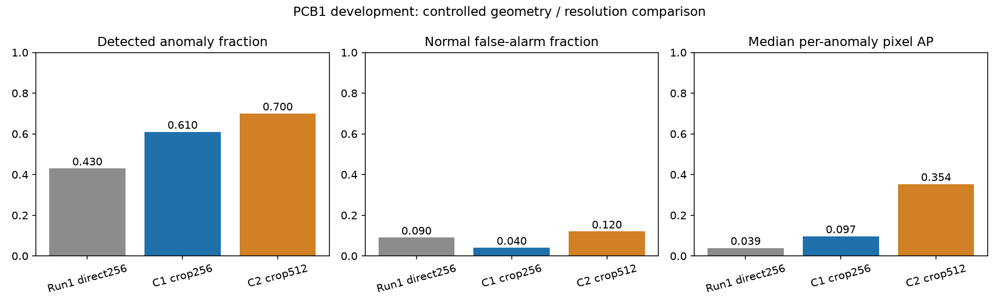
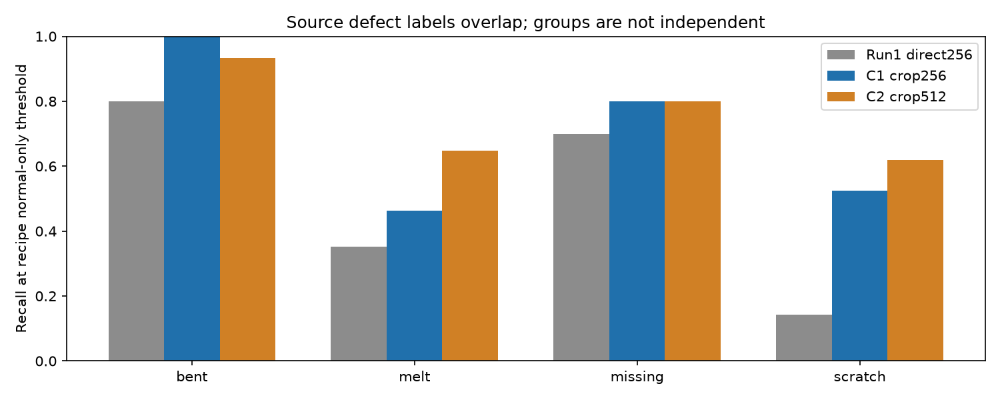

# Board geometry and resolution: what changed, and what we learned

Executed October2,2026. **PCB1 development results.** The original frozen pilot
and A2 are preserved; PCB2 remains sealed. Both declared recipes were frozen before
normal fitting and each received one development evaluation. No anomaly-result
retuning occurred. This is progress on a portfolio benchmark, not factory validation.

## The question

Can the same detector do better when more of its pixels describe the board rather
than the surrounding table? First find the blue board from image content, add room
around connector pins and edges, and preserve its shape with gray letterbox padding.
Run that block at256 (C1), then512 (C2). The backbone and4096-reference policy stay
fixed. C1 tests the whole crop/aspect/padding block, not crop alone. C2 tests resolution
under reduced reference coverage, not an unconstrained resolution effect.

## Detection and localization together

Each recipe recalibrates its thresholds on the same181 normal boards. The threshold
policy remains the95th image/99th pixel quantiles, higher and strictgreater.
A2's retrospective best threshold was never used. There are100 anomalous and100
normal test images. All pixel comparisons below retain the common full-image256 view.

| Recipe | Recall | Normal FPR | Image AP | AUROC | Median anomaly pixel AP | Pixel IoU | Peak inside mask | Median inference(s) |
| --- | ---: | ---: | ---: | ---: | ---: | ---: | ---: | ---: |
| Run1 direct256 | 43% | 9% | 0.852 | 0.865 | 0.039 | 0.122 | 26/100 | 0.307 |
| C1 crop256 | 61% | 4% | 0.906 | 0.908 | 0.097 | 0.118 | 30/100 | 0.292 |
| C2 crop512 | 70% | 12% | 0.903 | 0.913 | 0.354 | 0.127 | 50/100 | 1.081 |

Recall answers how many defective boards were flagged; normal FPR answers how much
review burden was created on normal boards. Image AP/AUROC summarize ranking without
choosing a new threshold. Median per-anomaly pixel AP measures whether heatmaps rank
the real defect above other pixels in a typical defective image. IoU measures the
thresholded mask and can worsen even while ranking improves. These metrics must be
read together; high pooled pixel AP alone is inadequate.

The256 geometry block detected61 defects with4 false alarms, versus43 and9 in Run1.
Its median per-image localization rose from0.039 to0.097, but IoU fell from0.122 to0.118.
It is a useful improvement in this development set and still gives imprecise masks.

C2 detects70/100 anomalies with12/100 normal false alarms. Median per-image pixel AP
rises to0.354, but pooled pixel AP falls to0.686 (C1:0.813) and image AP is slightly
lower (0.903 versus0.906). The largest original size quartile loses median pixel AP
from0.809 to0.550 while the smallest improves from0.023 to0.203. More pixels help many
small/melt defects but do not produce a uniform improvement across this benchmark.
C2 costs1.081s per image versus0.292s for C1, about3.7times more.

Retain C1 as the lower-cost development reference with fewer normal reviews. C2 is
a useful localization candidate for a matched memory-selection test, not the
automatic replacement. Neither gives precise enough masks to claim factory readiness.

## Which defects benefited?

| Source label | Run1 direct256 | C1 crop256 | C2 crop512 |
| --- | ---: | ---: | ---: |
| bent | 12/15 | 15/15 | 14/15 |
| melt | 19/54 | 25/54 | 35/54 |
| missing | 14/20 | 16/20 | 16/20 |
| scratch | 3/21 | 11/21 | 13/21 |

Nine anomalous images have multiple source labels. The groups overlap and their
counts must not be added as if independent. Source masks identify the union of
annotated defects, so localization cannot be assigned to an isolated defect type.
Type and original mask-area-quartile tables are saved for both recipes. The quartile
memberships stay fixed from A2, making the same groups comparable.

## Did cropping hide difficult defects?

256: 0 fallbacks; 0/100 anomalous images with any annotated source pixel outside the crop; 512: 0 fallbacks; 0/100 anomalous images with any annotated source pixel outside the crop.

G0 processed all904 fitting/calibration normals without a fallback. Fourteen normal
examples, including the crop-size extremes, were visually reviewed before fitting.
In that sample, connectors and housings remained inside the margin. The actual
anomaly-mask containment check happens after the recipe is frozen; masks never guide
crop placement. Zero clipping here does not prove future containment on other data.
Pose/180-degree orientation remains unchanged and no registration is claimed.

Maps are stripped of padding, resized back into the source crop and pasted into the
full source image. Unobserved pixels receive scorezero while their ground truth stays
in the denominator. The common256 map uses a subsequent bilinear resize; masks are
nearest-resized directly from source. This interpolation path differs from Run1 and
belongs to the geometry intervention. Fullsource per-image supporting metrics are:

| Input | Source median pixel AP | Q25 | Q75 | Peak inside mask | Any overlap |
| --- | ---: | ---: | ---: | ---: | ---: |
| 256 | 0.092 | 0.021 | 0.383 | 32/100 | 93/100 |
| 512 | 0.352 | 0.117 | 0.552 | 46/100 | 98/100 |

Fullsource pooled AP is omitted for resource reasons. Source-resolution results are
not directly comparable to Run1's256 pixel denominator. The independent review
recomputed all common256 per-image AP; it did not separately recompute source metrics.

## Engineering cost

| Input | Normal preparation(s) | Normal peak RSS(GiB) | Evaluation peak RSS(GiB) | Evaluation p95(s) | Reference fraction |
| --- | ---: | ---: | ---: | ---: | ---: |
| 256 | 74.9 | 0.83 | 1.58 | 0.294 | 0.5533% |
| 512 | 239.4 | 1.04 | 1.59 | 1.101 | 0.1383% |

All declared resource gates passed:8GiB peak RSS,10s median inference and30min
preparation. A fixed4096 bank is sampled uniformly from all fitting patch positions;
features stream in small batches. It is not a5–10% coreset. Gray padding patches
remain eligible reference candidates and contribute to the image maximum, matching
the declared all-patches scoring rule.

New inference timing includes source hashing and geometry; original timing excluded
raw hashing and used warm images. Treat the table as measured local costs rather
than a perfectly matched latency benchmark. RSS is the macOS process high-water mark,
not total machine memory. CPU/M2Pro and fourthreads remain the execution environment.

## Inspect the same examples

The eleven example IDs were fixed in A2 before seeing these results. Each comparison
sheet keeps the same original image and source mask beside all three heatmaps.
Colors show map/pixel-threshold on a common0–2 display scale, not probabilities.
Metric calculations always use unnormalized maps.

- [Comparison sheet1](contact_sheet_01.png)
- [Comparison sheet2](contact_sheet_02.png)
- [Comparison sheet3](contact_sheet_03.png)
- [Exact selection IDs and reasons](qualitative_selection.csv)

## Validation and reproducibility

Frozen input/code/weight identities and every raw image identity were checked.
Independent review checked both normal quantile ranks, all200 image flags and
confusion counts, image AP/pairwise AUROC, all100 common256 anomaly pixel AP values,
full-image IoU counts, uniform memory indices/fitting membership and three freshly
re-extracted reference vectors. Original Run1 and A2 content identities remain intact.

See each run's `independent_review.json`, `protocol.json`, `prepared.json` and
`complete.json` under `artifacts/runs/geometry_256_v1` / `geometry_512_v1`.
All50 tests pass. The notebook is executed, schema-validated and contains no error
outputs. Its figures and all three comparison pages were visually inspected; a
clipped draft colorbar label was repaired before completion.

The executed notebook `notebooks/pcb1_geometry_resolution.ipynb` reads only saved
publishable tables and charts, so it does not need raw data, weights or inference.
Rebuilding detector runs requires local original data and saved weights; current
output directories deliberately reject silent overwrites. A new reproduction path
requires an explicitly recorded run identity, not deleting the originals.

The next decision should weigh localization consistency and normal review burden
alongside computational cost. Compare uniform against approximate greedy selection
at the same actual reference count before increasing memory or replacing the backbone.
A larger backbone or spatial restriction is not part of these results. This blue-board
crop is category-specific; future PCB2 adaptation must be fully specified and frozen
before inspecting PCB2 anomalies. No fresh-category generalization claim is available.

[Coordinate rules and experiment controls](../../docs/development/geometry_resolution_protocol_review.md)

[Execution/exposure ledger](../../docs/development/geometry_execution_ledger.md)
