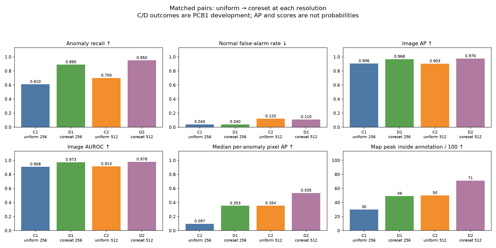

# Stage 3 findings: representative normal memory

Completed October 2, 2026. Public VisA PCB1 development data, 100 anomalies and 100
normals per recipe. This project uses no Seagate production data. PCB2 remains sealed.

## Answer and decision

**At the same 4,096-reference budget, this projected approximate greedy selector
improved detection and typical localization at both resolutions.** Carry D1 (crop
256 with representative memory) forward as the default development recipe: 89/100
anomalies detected, four normal flags and approximately 0.291 seconds median CPU
processing. Preserve D2 as the higher-recall/localization alternative; it detects
95/100 but flags eleven normals and takes approximately 1.081 seconds.

The next work is to freeze category adaptation and check crop suitability using
allowed normals before fresh PCB2 confirmation. The PCB1 blue-board geometry must
not be assumed to generalize. That work has not started; no Stage 4 intervention,
UI or LLM integration is bundled into this study.

## Matched comparisons first

C1→D1 changes only selection, while recalibrating each bank using the same 181
normal images and unchanged 95th/99th `higher` quantile policies with strict `>`
decisions. D1 gains **28 detected anomalies**, with unchanged four normal false
alarms. Image AP increases 0.9056→0.9680 and AUROC 0.9082→0.9731. Median anomaly pixel
AP rises 0.0968→0.3529; pooled pixel AP rises 0.8134→0.8452 and peaks inside the mask
rise 30→49. Thresholded pixel IoU slightly falls 0.1182→0.1153: better ranking does
not guarantee a compact highlighted region. D1 still misses eleven anomalies.

C2→D2 gains **25 detected anomalies**, with normal flags 12→11. Image AP increases
0.9031→0.9760 and AUROC 0.9133→0.9782. Median anomaly pixel AP rises 0.3535→0.5348,
pooled pixel AP 0.6863→0.8300, IoU 0.1273→0.1411 and peaks inside masks 50→71.
Overlap occurs on 98/100 anomalies for both banks, so that metric does not improve.
D2 still misses five anomalies. Observed normal false alarms are descriptive counts
on 100 development normals, not an established factory operating guarantee.

## Entire project journey

All common pixel metrics use the full-source 256 view, source masks nearest-resized
and scores inverse-mapped through the fixed crop/letterbox. Outside-crop scores are
zero; ground truth remains in the denominator. All 200 images contribute to pooled
pixel AP and IoU; per-image medians use the 100 anomalies. None of the anomaly masks
lay outside the crop. AP and score ratios are not calibrated probabilities.

| Recipe | TP / FN | FP / TN | Image AP | AUROC | Median pixel AP | Pooled pixel AP | IoU | Peak inside /100 | Median CPU s |
| --- | ---: | ---: | ---: | ---: | ---: | ---: | ---: | ---: | ---: |
| Run1 direct256 | 43 / 57 | 9 / 91 | 0.8516 | 0.8654 | 0.0393 | 0.7920 | 0.1218 | 26 | 0.307 |
| C1 uniform256 | 61 / 39 | 4 / 96 | 0.9056 | 0.9082 | 0.0968 | 0.8134 | 0.1182 | 30 | 0.292 |
| C2 uniform512 | 70 / 30 | 12 / 88 | 0.9031 | 0.9133 | 0.3535 | 0.6863 | 0.1273 | 50 | 1.081 |
| D1 coreset256 | 89 / 11 | 4 / 96 | 0.9680 | 0.9731 | 0.3529 | 0.8452 | 0.1153 | 49 | 0.291 |
| D2 coreset512 | 95 / 5 | 11 / 89 | 0.9760 | 0.9782 | 0.5348 | 0.8300 | 0.1411 | 71 | 1.081 |

[Complete comparison table](comparison.csv), [matched deltas](matched_pair_changes.csv)
and [journey figure](journey.png) retain all five recipes. The original pilot was
frozen before scoring; subsequent PCB1 comparisons are development evidence and
cannot make the already exposed benchmark fresh again.

## Where improvement is uneven

| Source type | Images | C1 detected | D1 detected | C2 detected | D2 detected |
| --- | ---: | ---: | ---: | ---: | ---: |
| Bent | 15 | 15 | 15 | 14 | 15 |
| Melt | 54 | 25 | 47 | 35 | 52 |
| Missing | 20 | 16 | 19 | 16 | 17 |
| Scratch | 21 | 11 | 18 | 13 | 21 |

Nine images have multiple types, yielding 110 memberships; counts are not exclusive
and must not be summed as independent detections. Their masks are union annotations,
so type-specific localization does not isolate a separate physical defect. D2's
missing-group detection and median AP remain below D1 (17 versus 19 detections;
0.946 versus 0.970 median AP), despite better aggregate D2 results.

Fixed A2 size quartiles contain 27/24/25/24 images. Smallest-quartile detections
increase C1→D1 from 14→22 and C2→D2 from 16→23; median pixel AP rises 0.023→0.258
and 0.203→0.388 respectively. Largest-quartile detection reaches 24/24 in both D
recipes, but D2's median localization (0.746) is below D1's (0.871). These slices
show associations under this recipe, not proof of resize or memory causality.
Full [type](type_recall_comparison.csv) and [size](size_localization_comparison.csv)
tables preserve original membership and boundaries.

## What changed inside the memory

All 740,352 candidates at 256 and 2,961,408 at 512 remained eligible, including
padding. A seed-43 Gaussian 384→64 projection is used only during selection.
Ten seed-42 fitting-normal anchors initialize mean Euclidean distance; subsequent
farthest-first steps update minimum distance to selected centers. Stable row-major
candidate order, lowest-index ties, selection order and 4,096 unique indices are
recorded. Stored scoring vectors are re-extracted in the original 384 dimensions.
This author-inspired approximation differs from the original PatchCore projection,
seed stream, backbone and other choices; it is not a faithful full reproduction.
See the [frozen method notes](../../docs/development/stage3_method_notes.md).

The same 2,048 seed-44 fitting-normal query positions compare banks within each
resolution. Query positions may also be references; exact-zero/self-membership
counts are reported. This is fitting-data coverage, not unseen-normal validation.

| Resolution | Mean distance, uniform→coreset | p95 | Maximum | Represented fitting images | Padding-center fraction |
| --- | ---: | ---: | ---: | ---: | ---: |
| 256 | 0.936→1.163 | 1.517→1.424 | 2.083→1.659 | 720→667 /723 | 26.37%→1.00% |
| 512 | 1.034→1.361 | 1.710→1.615 | 2.370→1.984 | 719→691 /723 | 27.22%→0.56% |

Mean and median distances worsen while upper-tail distances improve. Do not call
this uniformly better coverage. Selected vectors have no exact duplicates; the
new banks represent fewer source images and distribute references less evenly.
Padding-center membership is a geometry proxy and does not describe the complete
receptive field. Composition is consistent with a more concentrated selection,
but does not establish why detector performance changed. [Diagnostics](memory_composition.png),
[coverage](coverage_comparison.csv), [composition](memory_composition.csv) and
[regions](memory_regions.csv) expose these tradeoffs.

## Costs and resource gates

| Recipe | Charged preparation s | Current physical s | Selection s | Normal preparation peak GiB | Median / p95 inference s |
| --- | ---: | ---: | ---: | ---: | ---: |
| D1 | 117.955 | 117.955 | 18.363 | 0.975 | 0.291 / 0.296 |
| D2 | 361.741 | 317.126 | 72.511 | 2.175 | 1.081 / 1.138 |

D1 projection costs 22.413 seconds, re-extraction 21.856 and calibration 53.034.
D2 re-extraction costs 43.172 and calibration 198.345; its validated normal-only
engineering cache adds the original measured 44.616 extraction seconds to the
end-to-end gate. The current physical time is shown separately to avoid treating
cache reuse as free preparation. Both passed 30-minute, 8-GiB preparation limits
and 10-second median normal-inference limits before anomaly access. Evaluation
and independent reporting also consume time beyond preparation. [Runtime table](runtime_comparison.csv)
reports process high-water RSS across available phases; the peak column above is
specifically normal preparation. [Phase costs](runtime_phases.csv) retain the details.

The unchanged memory count keeps measured inference close to the uniform controls.
Original pilot timing excluded raw hashing; later development timing includes it,
so original-to-development speed ratios are not perfectly matched. Score summaries
and raw saved distributions are available in [score summaries](score_distribution_summary.csv)
and [per-image scores](score_distributions.csv); raw scales differ across banks.

## Fixed examples and validation

The same eleven A2 examples were selected before C/D outcomes. The
[contact sheet](fixed_a2_qualitative.png) includes misses, type representatives,
small regions and normal false alarms, with unchanged source annotations. Map
colors show each map divided by its own pixel threshold, clipped 0–2, and are not
probabilities. One previously selected normal example clears D1 while another
becomes a D1 false alarm; unchanged aggregate FPR does not mean identical boards
are flagged. [Example metrics](qualitative_metrics.csv) and [selection reasons](qualitative_selection.csv)
retain full IDs. All six figures were visually inspected; legends were moved away
from data where needed. The notebook reads saved artifacts and performs no inference.

All **81 automated tests passed**. Selector/runner/diagnostic/review checks and independent run reviews
cover unique fitting membership, frozen controls and hashes, threshold quantile
ranks, all 200 image flags/AP/AUROC, all 100 common pixel AP values, pooled pixel AP,
IoU and all 200 inverse-map reconstructions. Original scoring vectors/projections
were re-extracted at five fixed selection orders. A NumPy prefix oracle checks D1's
first 16 selections; D2 checks the prior 64-step engineering prefix. Full selection
was not rerun independently. Source-resolution AP is checked on three fixed examples,
not all 100 anomalies; source medians 0.350/0.534 are supporting results.

Both [D1 review](../runs/coreset_256_v1/independent_review.json) and
[D2 review](../runs/coreset_512_v1/independent_review.json) passed. Normal coverage
checks independently rechecked 16 fixed query distances against each bank.
The [new registry](../stage3_experiment_registry.csv),
[protocol](../../configs/stage3_protocol.json),
[execution notes](../../docs/development/stage3_execution_notes.md) and
[exposure ledger](../../docs/development/stage3_exposure_ledger.md) record chronology.
Historical protocols, code, completion receipts and baseline artifacts remain intact.

## Limits of the conclusion

One selector, one projection and one memory budget were tested on an already exposed
category. This supports the declared selection recipe, not the claim that selection
was the only bottleneck or that all coresets improve every detector. Pose registration,
spatial restrictions, larger memory and new backbones remain untested. Physical board
identities and factory conditions are unknown. Pretrained-weight commercial rights
remain unverified. No fresh PCB2 results or factory readiness are claimed.
