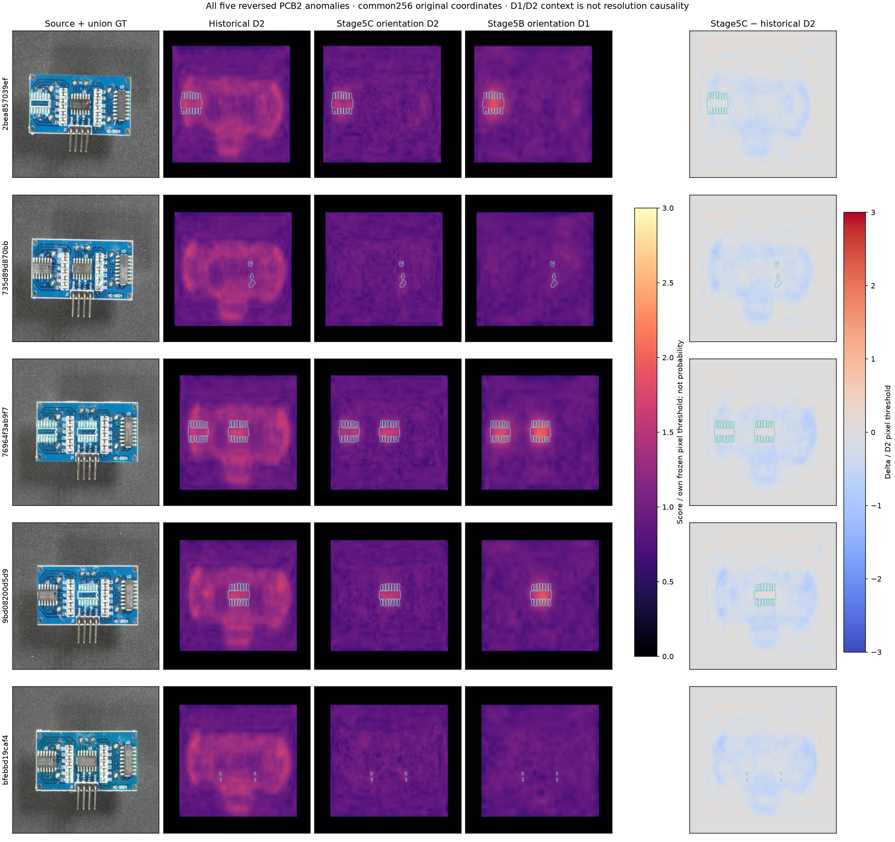
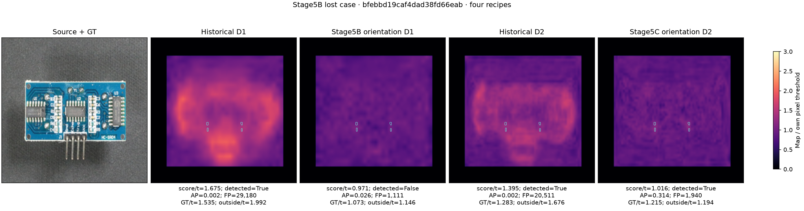
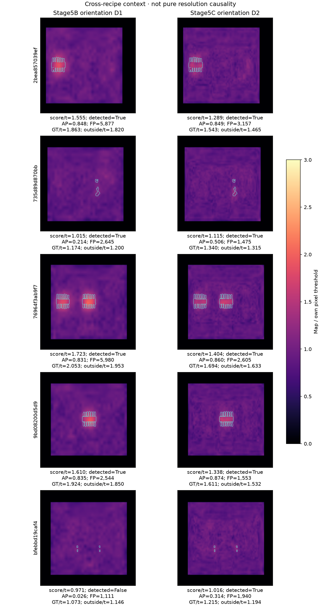
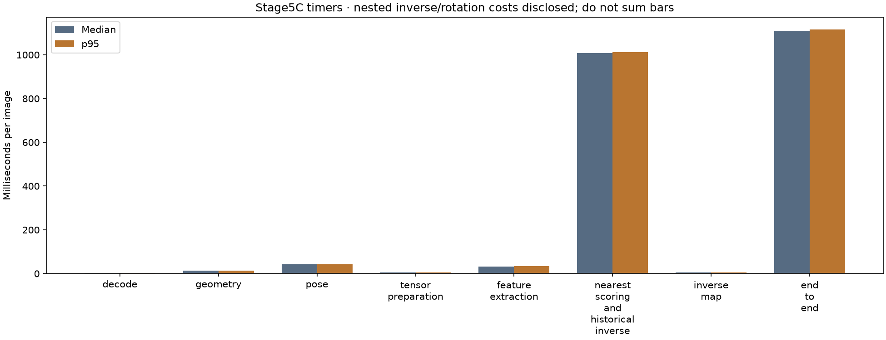

# Stage 5C — Can 512 preserve defect signal after pose cleanup?

Completed October 5, 2026 (America/Vancouver). **Post-confirmation PCB2 development evidence.**

## Why this experiment exists

Stage 5B reduced reversed D1 false-positive pixels by 87.65%, but lost one small missing-component case (`bfebbd19caf4dad38fd66eab`) and left a melt case (`735d89d870bbb25b3bc3dfce`, label from saved source annotations) narrowly detected. The question is whether the existing D2 recipe preserves true defect evidence after pose response is removed.

The [handoff evaluation](../development/stage5c_plan_review.md) accepts the controlled experiment and clarifies metric coordinates, historical identities, causal interpretation and timer boundaries. This experiment uses the unchanged Stage 5B orientation implementation imported directly, at D2's 512 input size. Canonical and uncertain inputs are no-ops; exactly five reversed crops receive an exact 180° array reversal before resize. Original source GT remains untouched. The native 512 map is unpadded, bilinearly resized to crop coordinates, inverse-reversed, pasted into the original source, and resized to common 256 for matched evaluation.

## Hypothesis and frozen comparison

Within historical D2, orientation handling is the only intervention. ResNet18 weights, aggregated layer2/layer3 features, 384-dimensional Euclidean embeddings,4096 ordered references, crop/margins, gray letterbox, maximum patch score, threshold calibration and evaluation identities remain frozen. Image threshold 2.060171127319336 and pixel threshold 1.6943607330322266 retain strict `>` semantics. No bank construction, threshold tuning, spatial restriction, feature changes or pose refinement occurred.

The [protocol](../../artifacts/stage5c/orientation_protocol.json), [freeze receipt](../../artifacts/stage5c/freeze_receipt.json) and saved-artifact [preexperiment signal audit](../../artifacts/stage5c/preexperiment_signal_audit.csv) precede new inference. The primary comparison is historical D2 versus orientation D2. Stage 5B D1 versus Stage 5C D2 is **cross-recipe context, not pure resolution causality**: candidate counts, reference fractions, independently calibrated thresholds and score distributions also differ. Score/threshold ratios are within-recipe margins, not probabilities or shared calibrated confidence.

## Matched D2 result

Reversed detection remains **5/5**, while total common 256 FP pixels fall **97,150 → 10,730 (88.96%)**. Every reversed case improves pixel AP and reduces FP. Median reversed FP falls 19,367 → 1,940, and median reversed AP rises 0.2739 → 0.8491. Native content exceedance fraction median falls 0.5020 → 0.0677. The median native-positive bounding-box fraction falls only 0.9844 → 0.8731; sparse exceedances still span much of the crop. Cleanup means a substantial reduction in exceedance density and FP burden, not a perfectly compact footprint. The fixed grid and spread diagnostics retain that distinction.

| Image ID | FP pixels: historical → orientation D2 | Pixel AP: historical → orientation D2 | Image score / threshold | Detection |
| --- | ---: | ---: | ---: | --- |
| `735d89d870bbb25b3bc3dfce` | 19,627 → 1,475 | 0.0076 → 0.5065 | 1.1153 | retained |
| `9bd08200d5d939f4a498aae7` | 19,104 → 1,553 | 0.2739 → 0.8739 | 1.3375 | retained |
| `2bea857039ef9c03907fb299` | 19,367 → 3,157 | 0.3756 → 0.8491 | 1.2886 | retained |
| `76964f3ab9f7c03b08de6900` | 18,541 → 2,605 | 0.4694 → 0.8605 | 1.4039 | retained |
| `bfebbd19caf4dad38fd66eab` | 20,511 → 1,940 | 0.0020 → 0.3141 | 1.0156 | retained |

## The Stage 5B lost case and narrow-margin case

`bfebbd19caf4dad38fd66eab` is recovered by orientation D2: native maximum-patch image score 2.092277 exceeds 2.060171 by **0.032106 (1.56%)**. This is a narrow rescue, not a large safety margin. Stage 5B orientation D1 score/threshold was 0.9712; Stage 5C is 1.0156. Common256 pixel AP improves from 0.0258 in orientation D1 to 0.3141 in orientation D2; those are cross-recipe contextual outcomes.

Within D2, this case's FP burden falls 20,511 → 1,940, AP 0.0020 → 0.3141, and GT intersection 50 →48. Common256 GT maximum falls 2.173537 →2.058974, while outside-GT maximum falls 2.840434 →2.023093. The inside-minus-outside contrast changes −0.666897 →+0.035880. Orientation removed broad response while leaving stronger relative defect-region contrast. The interpolated common-map GT maximum remains slightly below the **image** threshold; it is evaluated against the separate **pixel** threshold1.694361. Native maximum-patch image score and interpolated map maxima are different measurements.

The previously narrow D1 melt case (`735d89d870bbb25b3bc3dfce`) retains orientation D2 detection with score/threshold1.1153, versus 1.0146 for orientation D1. Its D2 matched FP falls 19,627 →1,475 and AP 0.0076 → 0.5065. Existing saved source labels identify it as melt; no relabeling occurred. All three other reversed cases also retain detection and improve AP/FP.

## Full fixed-population metrics

| Quantity | Historical D2 | Orientation D2 |
| --- | ---: | ---: |
| TP / FN | 91 / 9 | 91 / 9 |
| FP / TN | 4 / 96 | 4 / 96 |
| Image AP / AUROC | 0.9770 / 0.9697 | 0.9766 / 0.9693 |
| Median anomaly pixel AP | 0.4957 | 0.5101 |
| Pixel AP Q25 / Q75 | 0.2967 / 0.6723 | 0.3128 / 0.6779 |
| Pooled pixel AP | 0.2766 | 0.4449 |
| IoU | 0.07044 | 0.09328 |
| Peak inside /100 | 71 | 73 |
| Any overlap /100 | 100 | 100 |
| Total FP pixels | 325,593 | 239,173 |
| Missing-label detection /19 | 13 | 13 |
| Fixed R1/R2 detection /29 | 21 | 21 |

Canonical and uncertain anomaly outputs are exactly unchanged. Canonical detection 81/90 and uncertain 5/5 are implementation controls, not new generalization evidence. Canonical missing/small defects remain unresolved. Full recall 91%, normal FPR 4%; benchmark prevalence is 50%.

## Evidence and validation

The [paired D2 table](../../artifacts/stage5c/results/reversed_paired_d2.csv), [four-recipe signal table](../../artifacts/stage5c/results/four_recipe_signal.csv), [lost-case table](../../artifacts/stage5c/results/lost_case_signal.csv), [context table](../../artifacts/stage5c/results/orientation_256_vs_512_context.csv), [full metrics](../../artifacts/stage5c/results/full_metrics.json), [no-op controls](../../artifacts/stage5c/results/no_op_invariance.csv), [map differences](../../artifacts/stage5c/results/map_difference_statistics.csv), [4×4 grids](../../artifacts/stage5c/regional/reversed_grid_comparison.csv) and [map spread](../../artifacts/stage5c/regional/map_spread.csv) and [independently checked source-coordinate support](../../artifacts/stage5c/results/reversed_source_support.csv) retain every targeted case. Common256/source/native 512 counts have distinct denominators; native grids restore content orientation without moving asymmetric padding. Common maps show interpolated local evidence and are distinct from native maximum-patch image scores.

The [independent computational audit](../../artifacts/stage5c/independent_review.json) uses separate NumPy/sklearn pixel metrics and grid calculations, original source masks, manual RGB letterbox reconstructions and float64 SciPy Euclidean distances for all five reversed cases. It does not call the orientation wrapper or detector metric helpers. It shares the frozen feature extractor and source evidence; it is not a separate human review. The five bounded re-extractions are numerical validation, not another full experiment or tuning round. Maximum score error is 6.09e-7 and maximum map error 1.20e-6, below the declared independent 1e-5 numeric bound. **All 139 tests passed**, and the four-cell artifact-only notebook executed successfully. The supporting source audit independently reconciles 10 historical/new full-source rows. All seven figures were visually inspected.

All 1,101 RGB pose labels, 200 inverse maps, 195 exact unrotated map/score/flag controls and 100 unchanged normal flags are checked. Historical no-op source maps are reconstructed from unchanged native maps because Stage4 did not retain full-source map caches. Earlier stage receipts remain immutable; Stage 5B's snapshots preserve pre-Stage 5B navigation, and Stage 5C snapshots preserve pre-Stage 5C navigation.

## Engineering cost

Median end-to-end **1.1104s**, p95 **1.1164s**; reversed/no-op medians 1.1164/1.1104s. Peak RSS **1.644 GiB**. Median pose 42.22ms; reversed-only exact array rotation 3.728ms. Median frozen features/scoring including historical inverse 1.0077s. Full timer rows are saved in [runtime.csv](../../artifacts/stage5c/results/runtime.csv).

End-to-end includes source opening/decoding, geometry, pose, tensor preparation, frozen features/scoring (including historical common inverse), and additional orientation-aware source/common inverses. It excludes GT metrics, saving, no-op tensor control, bank/model loading and the full pose inventory audit. First image is retained. Scoring and inverse timer boundaries are nested; do not sum all chart bars. Actual input-array rotation is separately recorded inside the unchanged wrapper. Inverse orientation rotation remains nested in source/common inverse timings; separately instrumenting it would change the frozen wrapper, so no separate actual in-run inverse-rotation duration is claimed. Historical runtime ratios are contextual because boundaries differ.

## Limits and next decision

**Strong support on the observed five-case development target, with a marginal rescue.** The predeclared 5/5 guardrail holds, the lost D1-orientation case is recovered, all five AP/FP outcomes improve, and no-op controls remain exact. Retain D2+orientation as a high-sensitivity development candidate. The rescued case's 1.56% image margin and residual pixel AP 0.3141 warrant caution; stronger evidence does not imply robust handling of all small defects.

The evidence supports that the existing orientation-normalized 512 D2 recipe preserved defect signal on these observed cases while reducing broad pose response. It does not isolate resolution as the cause. Preserve historical D1 as the original primary and historical D2 as its unchanged matched baseline. Do not lower thresholds or modify this completed recipe.

**Next research question:** why do canonical missing/small defects remain difficult? A separate diagnostic stage should examine the six canonical missing-label D2 misses, fixed R1/R2 failures and the marginal rescued reversed case, using saved representations and aggregation evidence before choosing one new frozen intervention. No next-stage detector or UI was started.

The target has only five reversed anomalies and no reversed normal controls. PCB2 is already exposed, GT unions overlap, physical board identities are unknown, and uncertain pose cues remain no-ops. This experiment cannot establish arbitrary rotation handling, reversed-normal safety, canonical missing-defect rescue, fresh-category generalization or factory readiness. Original historical Stage4 D1 remains the portfolio primary. See the [artifact-only notebook](../../notebooks/pcb2_stage5c_orientation512.ipynb); local raw/cache evidence is required for raw-map revalidation.
